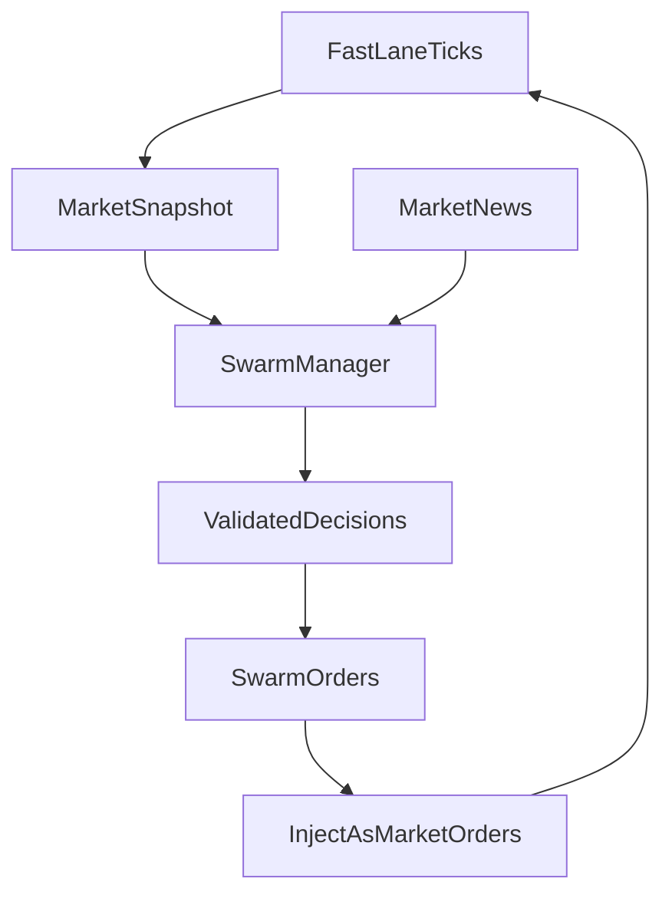

# Hybrid GABM-RL Project Baseline

## Purpose

This repository is now initialized as an interface-first baseline for a hybrid financial market simulator with two distinct clocks:

- the **Fast Lane**, where a limit order book (LOB) evolves at high frequency and is exposed through a `gymnasium` environment for reinforcement learning,
- and the **Slow Lane**, where a swarm of LLM-driven retail traders reacts asynchronously to market snapshots and news.

The scaffold is intentionally conservative: it defines clean contracts, validated payloads, and orchestration hooks without pretending to replace the supervisor-provided matching engine.

## Directory Structure

```text
.
├── agents/
│   ├── __init__.py
│   ├── config.py
│   └── train_ppo.py
├── core/
│   ├── __init__.py
│   ├── env.py
│   ├── interfaces.py
│   └── models.py
├── data/
│   └── .gitkeep
├── docs/
│   └── project_baseline.md
├── sim/
│   ├── __init__.py
│   └── orchestrator.py
├── swarm/
│   ├── __init__.py
│   ├── client.py
│   ├── manager.py
│   ├── models.py
│   ├── personas.py
│   └── prompts.py
├── .gitignore
├── main.py
├── pyproject.toml
└── README.md
```

## Module Responsibilities

### `core/`

This package contains the canonical market-facing contracts.

- `core/models.py`
  - `Level`: one price/volume pair in the order book.
  - `Order`: the normalized order schema submitted to the LOB.
  - `AgentDecision`: a higher-level action proposal that may be `buy`, `sell`, or `hold`.
  - `MarketSnapshot`: the typed state handoff between the fast lane and slow lane.
  - `SimulationConfig`: shared timing and environment configuration.
- `core/interfaces.py`
  - `MatchingEngineProtocol`: the minimal API expected from the supervisor's LOB implementation.
  - `coerce_snapshot(...)`: converts either a typed snapshot or raw mapping into `MarketSnapshot`.
- `core/env.py`
  - `MarketEnv(gym.Env)`: wraps the matching engine for RL training.
  - Encodes an observation vector from top-of-book depth, volumes, imbalance, last price, mid price, and spread.
  - Exposes a small discrete action space: `hold`, `buy`, `sell`.

### `agents/`

This package is the RL baseline layer.

- `agents/config.py`
  - `PPOTrainingConfig`: stores stable-baselines3 PPO hyperparameters.
- `agents/institutional.py`
  - `BaseInstitutionalAgent`: abstract interface for deterministic fast-lane agents.
  - `MeanReversionMarketMaker`: posts passive spread-capture quotes in calm markets and aggressive counter-orders when price deviates from its moving average.
- `agents/train_ppo.py`
  - `build_environment(...)`: wraps a concrete matching engine in `MarketEnv`.
  - `build_model(...)`: creates the PPO model.
  - `train(...)`: runs learning once a real LOB engine is supplied.

### `swarm/`

This package holds the slow-lane LLM retail trader logic.

- `swarm/models.py`
  - `RetailPersona`: captures retail behavior style and limits.
  - `SwarmRequest`: snapshot/news/persona bundle for one LLM call.
  - `LLMOrderResponse`: strict JSON contract expected back from the model.
- `swarm/personas.py`
  - Defines template personas for `fomo_driven`, `panicker`, and `value_investor`.
  - `generate_personas(count)` deterministically expands those templates into a swarm.
- `swarm/prompts.py`
  - Builds a persona-specific system prompt and a user prompt containing market snapshot plus news.
- `swarm/client.py`
  - `AsyncLLMClient` defines the shared client contract used by the swarm manager.
  - `GroqAsyncClient`, `OllamaAsyncClient`, and `OpenAICompatibleAsyncClient` provide switchable backends.
  - Provider config models centralize model name, base URL, timeout, temperature, and optional API keys.
- `swarm/manager.py`
  - `SwarmManager` uses `asyncio.gather(...)` to call all persona agents concurrently.
  - Validates every returned JSON payload before converting it into normalized `Order` objects.

### `sim/`

This package is the middleware between the two timescales.

- `sim/orchestrator.py`
  - `SimulationOrchestrator` advances the LOB for `fast_ticks_per_cycle`.
  - It then snapshots the market, sends that state and a news string to the LLM swarm, and injects the resulting orders back into the engine.
  - It collects cycle-level metrics and can export them as CSV using `pandas`.
- `sim/run_experiment.py`
  - Provides a unified experiment harness with scenarios, checkpoints, structured metrics, and run directories under `runs/`.

## Data Models And Why They Matter

The most important architectural decision in the baseline is the split between **decision objects** and **engine-ready orders**:

- `AgentDecision` is permissive enough for reasoning-oriented actors like RL policies or LLM personas.
  - It can represent `hold`.
  - It can carry a rationale or confidence score.
- `Order` is stricter and exists only for actionable submissions to the matching engine.
  - It only allows `buy` or `sell`.
  - It enforces consistency between `price_type` and `limit_price`.

This prevents the LLM layer from leaking malformed JSON or ambiguous intent directly into the fast lane.

## Gymnasium Environment Design

`MarketEnv` is a deliberately minimal RL wrapper designed for fast iteration:

- **Observation space**
  - A flat `Box` vector built from bid/ask prices and volumes for the configured depth.
  - Appends imbalance, last traded price, mid price, and spread.
- **Action space**
  - `Discrete(3)` for `hold`, `buy`, `sell`.
- **Step loop**
  - Decode RL action.
  - Convert it into an `AgentDecision`.
  - Submit an order if the action is not `hold`.
  - Advance the matching engine by one tick.
  - Compute a simple placeholder reward based on inventory multiplied by price delta.

The reward logic is intentionally simple because the correct reward function depends on the market microstructure objective you eventually want to optimize: market making, execution, alpha capture, inventory control, or impact minimization.

## Swarm Design

The swarm layer is built to support 50-100 asynchronous retail agents without blocking the fast lane design.

### Persona System

Each `RetailPersona` includes:

- an archetype,
- a risk appetite,
- a holding horizon,
- a capital limit,
- and qualitative behavior notes.

The current persona generator rotates across three archetypes:

- `fomo_driven`
- `panicker`
- `value_investor`

This gives you a repeatable initial population while keeping the generator simple enough to swap for a richer sampler later.

### Prompting

The prompt system is split into:

- a **system prompt** that fixes persona identity and enforces JSON-only output,
- and a **user prompt** that packages market state and exogenous news.

This separation makes it easier to experiment with:

- different market-news channels,
- persona perturbations,
- and stronger output constraints for production-grade validation.

### Provider Integration

The swarm layer now uses a provider-agnostic async client interface so the same `SwarmManager` can work with:

- `Groq` for hosted inference,
- `Ollama` for local Llama 3 testing,
- and OpenAI-compatible local servers such as LM Studio, vLLM, or `llama.cpp`.

All providers share the same JSON validation path. Each client uses `aiohttp` and returns a Python dictionary that is then validated by `LLMOrderResponse`.

This keeps the local and hosted testing paths aligned: prompts, persona logic, and output validation do not change when you switch providers.

## Two-Speed Orchestration

The central market loop is implemented in `SimulationOrchestrator`.

### Cycle Semantics

One cycle follows this sequence:

1. Advance the LOB for `fast_ticks_per_cycle`.
2. Capture a `MarketSnapshot`.
3. Send the snapshot plus a market-news string to the swarm.
4. Collect and validate all swarm decisions.
5. Convert actionable responses into orders.
6. Inject those orders back as market orders into the LOB.
7. Log metrics for analysis.

### Control Flow



### Why Force Market Orders On Injection?

The orchestrator currently normalizes all swarm outputs to market orders before submitting them back into the LOB. That is a pragmatic baseline choice because:

- it keeps the middleware simple,
- it avoids forcing a cross-timescale queue-placement model too early,
- and it makes the slow lane act like episodic retail flow hitting the fast lane.

If later experiments need richer behavior, you can preserve limit orders and route them differently.

## Logging And Data

The orchestrator stores one record per slow-lane cycle in memory and exposes:

- `to_dataframe()` for quick analysis,
- and `export_metrics(path)` for CSV output into `data/`.

The tracked baseline metrics currently include:

- cycle index,
- tick,
- market news,
- last price,
- mid price,
- spread,
- imbalance,
- number of swarm orders,
- injected order count,
- injected volume,
- and swarm error count.

This is enough to establish experiment traces before introducing richer PnL, inventory, slippage, or impact metrics.

## Entry Points

- `main.py`
  - lightweight bootstrap message and project guidance.
- `agents/train_ppo.py`
  - intended RL training entrypoint after a concrete engine is supplied.
- `sim/orchestrator.py`
  - intended simulation entrypoint once the engine and swarm credentials are available.

## What Is Still A Placeholder

This baseline is intentionally not a full runnable market simulator yet. The following integration points still require project-specific work:

- wiring the supervisor-provided matching engine to `MatchingEngineProtocol`,
- refining the current RL reward and metrics beyond the first meaningful accounting pass,
- deciding whether swarm outputs should remain market-only or become mixed market/limit flow,
- and upgrading the current experiment harness from mock-backed validation into real-LOB research runs.

## Recommended Next Steps

1. Create a real adapter around the supervisor's matching engine that implements `reset()`, `advance()`, `submit_order()`, and `get_snapshot()`.
2. Expand the reward and evaluation metrics with execution-aware objectives and richer PnL attribution.
3. Add named experiment scenarios and benchmark suites for fast-lane and slow-lane ablations.
4. Expand the market snapshot schema if you need richer RL observations such as queue position, recent trades, realized volatility, or news embeddings.
5. Add experiment dashboards or analysis notebooks on top of the structured `runs/` artifacts.
