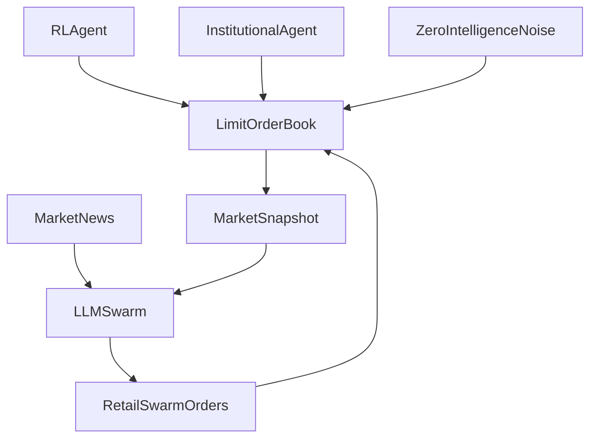

# Running And Flow Guide

## What You Can Run Right Now

This project is currently ready for:

- environment smoke testing with the mock matching engine,
- PPO construction smoke testing,
- local swarm transport and parsing smoke tests,
- and small provider-backed swarm demos against `LM Studio`, `Ollama`, or `Groq`.

It is not yet a full research-grade experiment harness with:

- the real supervisor LOB connected,
- multiple validated fast-lane institutional strategies,
- persistent experiment tracking,
- or rich analytics dashboards.

## Recommended Commands

Install and bootstrap:

```bash
make install
```

Run the environment and PPO smoke test:

```bash
make smoke
```

Run the local provider contract smoke test:

```bash
make swarm-smoke
```

Run a real provider-backed swarm demo:

```bash
make lmstudio
make ollama
make groq
```

Run the unified experiment harness:

```bash
make experiment
```

Run the integration tests:

```bash
make test
```

Override defaults when needed:

```bash
make lmstudio AGENT_COUNT=8 LMSTUDIO_MODEL="meta-llama-3-8b-instruct"
make ollama AGENT_COUNT=6 OLLAMA_MODEL="llama3:8b"
make groq AGENT_COUNT=10 GROQ_API_KEY="your_key_here"
make experiment SWARM_PROVIDER=mock NUM_CYCLES=50 SWARM_UPDATE_FREQ=5
make experiment SCENARIO=full_hybrid_mock
```

## What Output To Expect

### `make smoke`

This runs the mock engine and PPO smoke path. You should see output like:

- initial observation shape,
- initial tick and mid price,
- final tick and mid price after a short rollout,
- last reward,
- termination or truncation status,
- PPO environment type,
- and PPO policy class.

This confirms:

- `MarketEnv` can reset and step,
- the Poisson noise generator is active,
- the mock engine satisfies the environment contract,
- and SB3 can construct a PPO agent on top of the environment.

### `make swarm-smoke`

This runs a transport-level local provider validation using an in-process mock server. You should see:

- one `openai_compatible` smoke section,
- one `ollama` smoke section,
- counts of decisions/orders,
- a sample normalized order,
- and a success message.

This confirms:

- the provider client layer works,
- `SwarmManager` still parses responses correctly,
- and local JSON contracts are valid.

### `make lmstudio`, `make ollama`, `make groq`

These run a small real provider-backed swarm demo using a sample market snapshot. You should see:

- provider name,
- number of swarm agents,
- snapshot summary,
- current market news string,
- number of decisions received,
- number of actionable orders,
- any collected errors,
- and a few sample decisions with rationale text.

This is useful for:

- prompt iteration,
- persona sanity checks,
- JSON validation,
- and basic multi-agent behavior inspection.

These runs now also write structured artifacts under `data/runs/<run_id>/`.

The current run folder contains:

- `metadata.json`: provider, model, personas, config, and market news
- `snapshot.json`: the input market snapshot used for the run
- `summary.json`: top-level counts and timing
- `decisions.jsonl`: one validated swarm decision per line
- `orders.jsonl`: one actionable normalized order per line
- `errors.log`: provider or validation errors, if any

### `make experiment`

This runs the unified end-to-end experiment harness using:

- `MarketEnv`
- `MockMatchingEngine` for now
- PPO from `stable-baselines3`
- `MeanReversionMarketMaker` as a structured institutional fast-lane agent
- `SwarmManager`
- `SimulationOrchestrator`
- and the structured experiment logger

The full run is written to `runs/<run_id>/`.

The current run folder contains:

- `config.json`: full saved experiment configuration
- `metrics.csv`: per-cycle experiment metrics
- `summary.json`: top-level experiment summary
- `orchestrator_cycles.jsonl`: one slow-lane cycle record per line
- `orchestrator_metrics.csv`: orchestrator cycle table
- `orchestrator_summary.json`: orchestrator-specific summary
- `latest_swarm_orders.jsonl`: most recent swarm orders captured by the orchestrator
- `latest_injected_orders.jsonl`: most recent market-order injections
- `checkpoints/ppo_initial.zip`: initial PPO checkpoint
- `checkpoints/ppo_final.zip`: final PPO checkpoint

The runner also supports:

- named scenario presets from `configs/scenarios/`
- a real-engine adapter path through `--matching-engine-backend real`
- and deterministic tests for artifact generation and logging

The orchestrator can now use the same logger abstraction. When attached, it can persist:

- `orchestrator_cycles.jsonl`
- `latest_swarm_orders.jsonl`
- `latest_injected_orders.jsonl`
- `orchestrator_metrics.csv`
- and an orchestrator-focused `orchestrator_summary.json`

## Current Flow In Code

### Current Fast Lane

Right now the fast lane contains:

- the matching engine interface,
- the `MarketEnv`,
- the RL action path,
- institutional agents from `agents/institutional.py`,
- and the zero-intelligence Poisson noise flow.

In the current experiment harness, the fast lane is driven by:

- the RL agent action,
- institutional market-making / mean-reversion logic,
- plus synthetic noise orders,
- against a `MockMatchingEngine`.

### Current Slow Lane

The slow lane contains:

- persona generation,
- prompt construction,
- provider-backed LLM clients,
- `SwarmManager`,
- and response validation into normalized orders.

### Current Two-Speed Concept

The current orchestrator logic is:

1. Advance the fast lane for a batch of ticks.
2. Take a `MarketSnapshot`.
3. Send the snapshot plus market news to the swarm.
4. Collect validated swarm decisions.
5. Convert them into orders.
6. Inject those orders back into the matching engine.

So the correct interpretation is:

- the **swarm observes the market state after the fast lane evolves**,
- it does **not** directly receive raw RL or institutional orders as a message stream,
- instead it receives a **snapshot of the resulting market state** and a news string,
- then it returns orders that are injected back into the market.

## Answer To Your Architecture Question

Not exactly:

- it is **not** currently `RL agent + big institution agent -> pass orders down to swarm`
- it is closer to `fast lane agents affect the market -> take snapshot -> swarm reacts to that snapshot`

In other words, the swarm should be modeled as a slower observer/reactor to market conditions, not as a downstream processor of individual order objects.

## Recommended Conceptual Flow

The clean architecture for experiments is:



This means:

- the RL agent is one participant in the fast lane,
- the institutional agent would be another participant in the fast lane,
- the noise generator can remain a background liquidity source,
- and the swarm acts as a slower retail layer that reacts to the state of the market.

## What Is Missing For Full Experiments

To say the engine is fully ready for experiments, the project still needs:

- the real supervisor matching engine wired in,
- broader institutional strategy coverage beyond one market maker,
- richer reward and evaluation metrics,
- and stronger long-run validation on real provider and real LOB paths.

## Logging Status

Logging is currently good enough for development and smoke runs, but not yet ideal for serious experiments.

### What Exists

- readable console output for smoke tests,
- readable console output for live swarm demo runs,
- structured run artifacts in `data/runs/` for provider-backed swarm demos,
- structured orchestrator cycle logs when a logger is attached,
- and in-memory cycle-level metric storage in `SimulationOrchestrator.records`.

### What Does Not Exist Yet

- one single end-to-end experiment runner that always attaches the orchestrator logger automatically,
- richer latency breakdown per agent request,
- automatic CSV/Parquet export for every experiment mode,
- and unified run IDs shared across env, orchestrator, and swarm layers.

## Suggested Next Logging Upgrade

The most useful next step would be a lightweight experiment logger that writes:

- run configuration,
- provider/model details,
- market news,
- full swarm decisions,
- normalized orders,
- orchestrator metrics,
- and timestamps

into `data/` for every run.

That would make the project much closer to a real experiment platform rather than a smoke-tested prototype.
